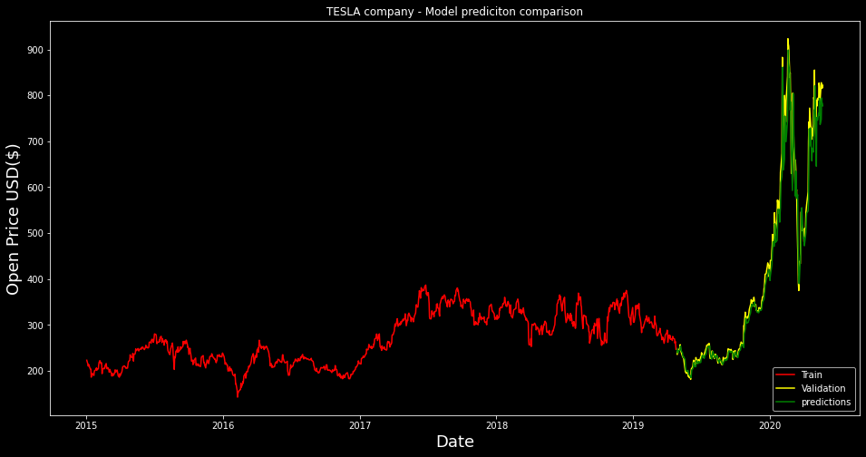

# Stock Price Predicition

## Contents

1 - Detailed_visualisation_of_stocks.ipynb

2 - Opening_Price_Prediction_keras.ipynb

3 - Closing_Price_Prediction_Keras.ipynb

4 - TCS_Stock_Prediction_LSTM_quandl_api.ipynb

5 - MRF_Stock_Prediction_Using_LSTM.ipynb

6 - Complex_Stock_Visualisation,_LSTM_based_comparison_of_Return,_Votality,_Trading_volume.ipynb

7 - Stocks_Comparison_KNN,_Random_Forest,_LSTM,_CNN,_XGboost.ipynb

----
samplecsv files included in seprate folder - "CSV FILES".

## Companies covered

-Apple

-Tesla

-Amazon 

-Tata Consultancy Services (TCS) - TCS_Stock_Prediction_LSTM_quandl_api.ipynb

-MRF Limited(MRF) - MRF_Stock_Prediction_Using_LSTM.ipynb

### Opening_Price_Prediction

## For Stock data -

Use Pandas_ Datareader function - from pandas_datareader import data or import pandas_datareader as web

https://www.alphavantage.co/ - Free API for donwloading or monitoring stocks

https://www.kaggle.com/camnugent/sandp500/data?select=individual_stocks_5yr - contains pre- downloaded Stocks values of different companies

Indian companies data - https://www.quandl.com/

### Detailed_visualisation_of_stocks

### TCS_Stock_Prediction

## Useful resources

Simple Stock preidictions and Visulaisation - dduemig/stanford-Project-Predicting-stock-prices-using-a-LSTM-Network

Prediciting Opening and closing prices - SnehJain/Deep-Neural-Networks-For-Stock-Price-Prediction

Combining Stock and Twitter Data(positive and negative comments) and Stock - viswa0531/StockMarketPredictionUsingML

### Complex_Stock_Visualisation 

